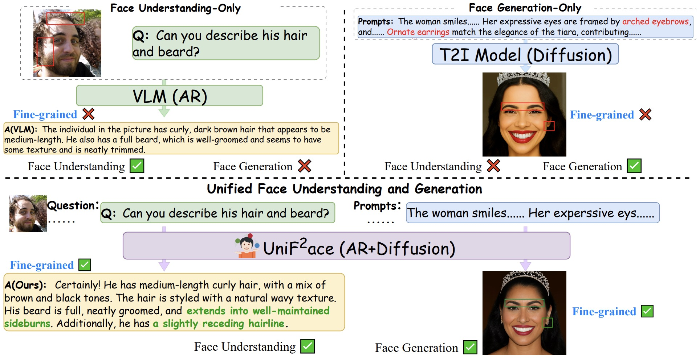

# UniF²ace: Fine-grained Face Understanding and Generation with Unified Multimodal Models

  

UniF²ace is the first unified multimodal model specifically designed for face understanding and generation, encompassing tasks such as visual question answering, face image captioning and text-to-face image generation. 

This repository contains code for the paper [UniF²ace: Fine-grained Face Understanding and Generation with Unified Multimodal Models](https://arxiv.org/abs/2503.08120).

**We will release the dataset and code soon!**

## License

All code within this repository is under [Apache License 2.0](https://www.apache.org/licenses/LICENSE-2.0).